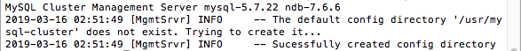
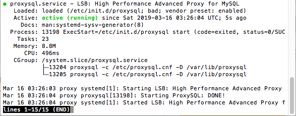

# Implementasi MySQL Multi-Node dan ProxySQL sebagai Load Balancer

## A.	Model Arsitektur
Sistem ini terdiri dari sebuah NDB Manager, 3 buah Data Node, 2 buah MySQL API Node, dan sebuah ProxySQL sebagai Load Balancer.
Berikut adalah pembagian IP beserta hostname yang digunakan:

| IP            | Nama                      | hostname  |
|---------------|---------------------------|-----------|
| 192.168.33.10	|	NDB Manager dan API Node	| manager   |
| 192.168.33.11	|	Data Node dan API Node		| data1     |
| 192.168.33.12	|	Data Node				          | data2     |
| 192.168.33.13	|	Data Node				          | data3     |
| 192.168.33.14	|	ProxySQL				          | proxy     |

## B.	Implementasi
### 1.	Konfigurasi Awal
Langkah awal dilakukan pada Vagrantfile.
Cara menjalankannya:
```
$ cd (direktori)
$ vagrant up
$ vagrant ssh (nama server)
```

### 2.	Instalasi dan Konfigurasi Cluster Manager
Masuk pada ```manager``` (192.168.33.10) dan mengunduh package
```
$ cd ~
$ wget https://dev.mysql.com/get/Downloads/MySQL-Cluster-7.6/mysql-cluster-community-management-server_7.6.6-1ubuntu18.04_amd64.deb
```
Menginstall ```ndb_mgdb``` menggunakan ```dpkg```
```
$ sudo dpkg -i mysql-cluster-community-management-server_7.6.6-1ubuntu18.04_amd64.deb
```
Membuat direktori ```/var/lib/mysql-cluster```
```
$ sudo mkdir /var/lib/mysql-cluster
```
Mengedit isi file ```config.ini```
```
$ sudo nano /var/lib/mysql-cluster/config.ini
```
Berikut isi ```config.ini```:
```
[ndbd default]
# Options affecting ndbd processes on all data nodes:
NoOfReplicas=3  # Number of replicas

[ndb_mgmd]
# Management process options:
hostname=192.168.33.10 # Hostname of the manager
datadir=/var/lib/mysql-cluster  # Directory for the log files

[ndbd]
hostname=192.168.33.11 # Hostname/IP of the first data node
NodeId=2            # Node ID for this data node
datadir=/usr/local/mysql/data   # Remote directory for the data files

[ndbd]
hostname=192.168.33.12 # Hostname/IP of the second data node
NodeId=3            # Node ID for this data node
datadir=/usr/local/mysql/data   # Remote directory for the data files

[ndbd]
hostname=192.168.33.13 # Hostname/IP of the second data node
NodeId=4            # Node ID for this data node
datadir=/usr/local/mysql/data   # Remote directory for the data files

[mysqld]
# SQL node options:
hostname=192.168.33.10 # In our case the MySQL server/client is on the same Droplet as the cluster manager

[mysqld]
# SQL node options:
hostname=192.168.33.11
```
Menjalankan manager dengan ```mdb_mgmd``` dan config file dengan ```-f```
```
$ sudo ndb_mgmd -f /var/lib/mysql-cluster/config.ini
```


Mematikan server yang masih berjalan
```
$ sudo pkill -f ndb_mgmd
```
Mengedit ```ndb_mgmd.service```
```
$ sudo nano /etc/systemd/system/ndb_mgmd.service
```
Berikut isinya:
```
[Unit]
Description=MySQL NDB Cluster Management Server
After=network.target auditd.service

[Service]
Type=forking
ExecStart=/usr/sbin/ndb_mgmd -f /var/lib/mysql-cluster/config.ini
ExecReload=/bin/kill -HUP $MAINPID
KillMode=process
Restart=on-failure

[Install]
WantedBy=multi-user.target
```
Mereload sistem manager menggunakan ```daemon-reload```
```
$ sudo systemctl daemon-reload
```
Mengaktifkan service yang telah dibuat
```
$ sudo systemctl enable ndb_mgmd
```
Menjalankan service
```
$ sudo systemctl start ndb_mgmd
```
Mengecek status
```
$ sudo systemctl status ndb_mgmd
```


Memberikan akses untuk koneksi dari luar
```
$ sudo ufw allow from 192.168.33.11
$ sudo ufw allow from 192.168.33.12
$ sudo ufw allow from 192.168.33.13
$ sudo ufw allow from 192.168.33.14
```

### 3.	Instalasi dan Konfigurasi Data Node
Masuk pada data node atau ```data``` (192.168.33.11, 192.168.33.12, 192.168.33.13) dan mengunduh package
```
$ cd ~
$ wget https://dev.mysql.com/get/Downloads/MySQL-Cluster-7.6/mysql-cluster-community-data-node_7.6.6-1ubuntu18.04_amd64.deb
```
Menginstall dependency ```libclass-methodmaker-perl```
```
$ sudo apt update
$ sudo apt install libclass-methodmaker-perl
```
Menginstall data node binary menggunakan ```dpkg```
```
$ sudo dpkg -i mysql-cluster-community-data-node_7.6.6-1ubuntu18.04_amd64.deb
```
Mengedit isi ```/etc/my.cnf```
```
$ sudo nano /etc/my.cnf
```
Berikut isi my.cnf :
```
[mysql_cluster]
# Options for NDB Cluster processes:
ndb-connectstring=192.168.33.10  # location of cluster manager
```
Membuat direktori
```
$ sudo mkdir -p /usr/local/mysql/data
```
Memulai data node
```
$ sudo ndbd
```
Pada data1


Pada data2


Pada data3


Memberikan akses untuk koneksi dari luar
```
$ sudo ufw allow from 192.168.33.10
$ sudo ufw allow from 192.168.33.11
$ sudo ufw allow from 192.168.33.12
$ sudo ufw allow from 192.168.33.13
$ sudo ufw allow from 192.168.33.14
```
Mematikan proses ```ndbd``` yang masih berjalan
```
$ sudo pkill -f ndbd
```
Mengedit ```ndbd.service```
```
$ sudo nano /etc/systemd/system/ndbd.service
```
Berikut isinya:
```
[Unit]
Description=MySQL NDB Data Node Daemon
After=network.target auditd.service

[Service]
Type=forking
ExecStart=/usr/sbin/ndbd
ExecReload=/bin/kill -HUP $MAINPID
KillMode=process
Restart=on-failure

[Install]
WantedBy=multi-user.target
```
Mereload sistem dengan menggunakan ```daemon-reload```
```
$ sudo systemctl daemon-reload
```
Mengaktifkan service yang telah dibuat
```
$ sudo systemctl enable ndbd
```
Menjalankan service
```
$ sudo systemctl start ndbd
```
Mengecek status
```
$ sudo systemctl status ndbd
```
Pada data1


Pada data2


Pada data3


### 4.	Konfigurasi MySQL Server dan Client
Masuk pada API node (192.168.33.10, 192.168.33.11) dan mengunduh package
```
$ cd ~
$ wget https://dev.mysql.com/get/Downloads/MySQL-Cluster-7.6/mysql-cluster_7.6.6-1ubuntu18.04_amd64.deb-bundle.tar
```
Membuat direktori
```
$ mkdir install
```
Mengekstrak arsip
```
$ tar -xvf mysql-cluster_7.6.6-1ubuntu18.04_amd64.deb-bundle.tar -C install/
```
Menginstall dependency komponen MySQL 
```
$ cd install
$ sudo apt update
$ sudo apt install libaio1 libmecab2
$ sudo dpkg -i mysql-common_7.6.6-1ubuntu18.04_amd64.deb
$ sudo dpkg -i mysql-cluster-community-client_7.6.6-1ubuntu18.04_amd64.deb
$ sudo dpkg -i mysql-client_7.6.6-1ubuntu18.04_amd64.deb
$ sudo dpkg -i mysql-cluster-community-server_7.6.6-1ubuntu18.04_amd64.deb
$ sudo dpkg -i mysql-server_7.6.6-1ubuntu18.04_amd64.deb
```
Mengedit isi ```/etc/mysql/my.cnf```
```
$ sudo nano /etc/mysql/my.cnf
```
Tambahan isi pada ```my.cnf```:
```
. . .
[mysqld]
# Options for mysqld process:
ndbcluster                      # run NDB storage engine
bind-address=...                # listen address ip saat ini
[mysql_cluster]
# Options for NDB Cluster processes:
ndb-connectstring=192.168.33.10  # location of management server
```
Merestart sistem
```
$ sudo systemctl restart mysql
```
Mengaktifkan konfigurasi yang telah dibuat
```
$ sudo systemctl enable mysql
```

### 5.	Verifikasi Instalasi MySQL Cluster
Masuk pada API node (192.168.33.10, 192.168.33.11)

Menjalankan:
```
$ mysql -u root –p
```
Masukkan password : ```admin```

Mengecek status
```
mysql> SHOW ENGINE NDB STATUS \G
```
Pada manager


Pada data1


Mengecek data dan service node yang terhubung
```
$ ndb_mgm
ndb_mgm> SHOW
```


### 6. Menambahkan Data pada MySQL Cluster
Mmebuat database ```clustertest```
```
mysql> CREATE DATABASE clustertest;
```


Pindah ke database tadi
```
mysql>  USE clustertest
```
Membuat tabel sederhana bernama ```test_table```
```
mysql> CREATE TABLE test_table (name VARCHAR(20), value VARCHAR(20)) ENGINE=ndbcluster;
```


Menambahkan data
```
mysql> INSERT INTO test_table (name,value) VALUES('some_name','some_value');
```
Melihat isi tabel
```
mysql> SELECT * FROM test_table;
```


### 7. Instalasi ProxySQL
Masuk pada ```proxy``` (192.168.33.14) , pada direktori ```/tmp``` unduh package
```
$ cd /tmp
$ curl –OL https://github.com/sysown/proxysql/releases/download/ v1.4.4/proxysql_1.4.4-ubuntu16_amd64.deb
```
Menginstall package ```mysql-client```
```
$ sudo dpkg -i proxysql_*
$ rm proxysql_*

$ sudo apt-get update
$ sudo apt-get install mysql-client
```
Menjalankan proxysql
```
$ sudo systemctl start proxysql
```
Mengecek status
```
$ systemctl status proxysql
```


### 8.	Setting password untuk ProxySQL Administrator
Pada ```proxy``` masuk ```ProxySQLAdmin``` prompt
```
$ mysql -u admin -p -h 127.0.0.1 -P 6032 --prompt='ProxySQLAdmin> '
```
Mengubah password
```
ProxySQLAdmin> UPDATE global_variables SET variable_value= 'admin:password' WHERE variable_name='admin-admin_credentials';
ProxySQLAdmin> LOAD ADMIN VARIABLES TO RUNTIME;
ProxySQLAdmin> SAVE ADMIN VARIABLES TO DISK;
```

### 9.	Konfigurasi Monitoring di MySQL
Pada service node (192.168.33.19, 192.168.33.11), mengunduh file
```
$ curl -OL https://gist.github.com/lefred/77ddbde301c72535381ae7af9f968322/raw/5e40b03333a3c148b78aa348fd2cd5b5dbb36e4d/addition_to_sys.sql
```
Menjalankan command file
```
$ mysql -u root -p < addition_to_sys.sql
```
Masuk pada MySQL prompt
```
$ mysql -u root –p
```
Membuat user monitor
```
mysql> CREATE USER 'monitor'@'%' IDENTIFIED BY 'monitorpassword';
mysql> GRANT SELECT on sys.* to 'monitor'@'%';
mysql> FLUSH PRIVILEGES;
```

### 10.	Konfigurasi Monitoring di ProxySQL
Pada ```proxy```

Mengupdate user baru
```
ProxySQLAdmin> UPDATE global_variables SET variable_value='monitor' WHERE variable_name='mysql-monitor_username';
ProxySQLAdmin> LOAD MYSQL VARIABLES TO RUNTIME;
ProxySQLAdmin> SAVE MYSQL VARIABLES TO DISK;
```

### 11.	Menambahkan node MySQL ke server Proxy
Pada ```proxy```, membuat baris baru dengan variable dan value pada ```mysql_group_replication_hostgroups```
```
ProxySQLAdmin> INSERT INTO mysql_group_replication_hostgroups (writer_hostgroup, backup_writer_hostgroup, reader_hostgroup, offline_hostgroup, active, max_writers, writer_is_also_reader, max_transactions_behind) VALUES (2, 4, 3, 1, 1, 3, 1, 100);
```
Menambahkan MySQL server (service node)
```
ProxySQLAdmin> INSERT INTO mysql_servers(hostgroup_id, hostname, port) VALUES (2, '192.168.33.10', 3306);
ProxySQLAdmin> INSERT INTO mysql_servers(hostgroup_id, hostname, port) VALUES (2, '192.168.33.11', 3306);
ProxySQLAdmin> LOAD MYSQL VARIABLES TO RUNTIME;
ProxySQLAdmin> SAVE MYSQL VARIABLES TO DISK;
```
Mengecek hostgroup
```
ProxySQLAdmin> SELECT hostgroup_id, hostname, status FROM runtime_mysql_servers;
```


### 12.	Membuat user MySQL
Membuat user baru ```bdtuser``` dengan password ```bdt```
```
mysql> CREATE USER 'bdtuser'@'%' IDENTIFIED BY 'bdt';
```
Memberikan akses grup replikasi untuk database ```clustertest```
```
mysql> GRANT ALL PRIVILEGES on clustertest.* to 'bdt'@'%';
```
Menyimpan perubahan
```
mysql> FLUSH PRIVILEGES
mysql> EXIT;
```

### 13.	Membuat user ProxySQL
Pada ```proxy```
```
ProxySQLAdmin> INSERT INTO mysql_users(username, password, default_hostgroup) VALUES ('bdtuser', 'bdt', 2);
ProxySQLAdmin> LOAD ADMIN VARIABLES TO RUNTIME;
ProxySQLAdmin> SAVE ADMIN VARIABLES TO DISK;
```

## C.	Menyimpan Data pada MySQL Cluster
Masuk pada mysql prompt dengan
```
$ mysql –u root –p
```
Membuat database sakila
```
mysql> create database sakila;
```
Keluar dari mysql dan import schema dan data sakila
```
sudo mysql –u root –p sakila < /vagrant/sakila-mv-schema.sql
sudo mysql –u root –p sakila < /vagrant/sakila-mv-data.sql
```
Malihat daftar database
```
mysql> show databases;
```


Melihat daftar table pada database sakila
```
mysql> use sakila;
mysql> show tables;
```


Memberikan akses grup replikasi untuk database ```sakila```
```
mysql> GRANT ALL PRIVILEGES on sakila.* to 'bdt'@'%';
```
Menyimpan perubahan
```
mysql> FLUSH PRIVILEGES
mysql> EXIT;
```

## D.	Tes Koneksi Keluar
Masuk menggunakan ```bdtuser```
```
$ mysql -u bdtuser -p -h 127.0.0.1 -P 6033 --prompt='ProxySQLClient> '
```
Melihat hostname server yang melayani adalah ```data1```
```
select @@hostname
```


Menggunakan tools lain


Menghentikan salah satu proses dari MySQL server (data1)
```
systemctl stop mysql
```


Mengecek kembali hostname server yang melayani berubah menjadi ```manager```


Menggunakan tools lain


Untuk menjalankan proses dari MySQL server (data1) yang sebelumnya dihentikan
```
systemctl start mysql
```

## Referensi
https://www.digitalocean.com/community/tutorials/how-to-create-a-multi-node-mysql-cluster-on-ubuntu-18-04
https://www.digitalocean.com/community/tutorials/how-to-use-proxysql-as-a-load-balancer-for-mysql-on-ubuntu-16-04#step-8-—-verifying-the-proxysql-configuration
