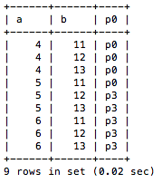
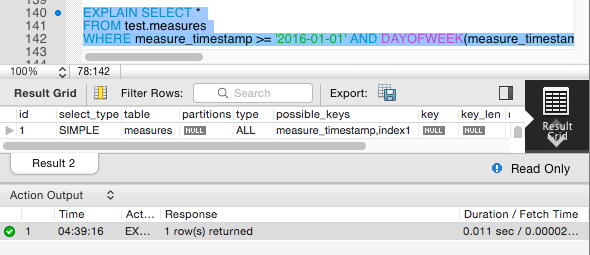

# Implementasi Partisi

Sebelum melakukan testing partisi tabel, mengimport database baru pada node service
```
mysql -u root -p -t < /vagrant/test.sql
```
Untuk mengecek database telah terimport dengan baik pada node service yg ditunjuk, masuk pada mysql prompt:
```
mysql -u root -p
```
```
mysql> show databases;
```

```
mysql> use test
mysql> show tables;
```


Memberikan permission pada ```bdtuser``` agar dapat mengakses database dari luar
```
mysql> GRANT ALL PRIVILEGES on test.* to 'bdtuser'@'%';
mysql> FLUSH PRIVILEGES;
```

## 1. Mengecek Status Plugin Partition Aktif

Mengecek status dengan syntax berikut:
```
SHOW PLUGINS
```
atau dengan
```
SELECT
    PLUGIN_NAME as Name,
    PLUGIN_VERSION as Version,
    PLUGIN_STATUS as Status
    FROM INFORMATION_SCHEMA.PLUGINS
    WHERE PLUGIN_TYPE='STORAGE ENGINE';
```


## 2. Membuat Partisi
### a. Range Partition
Pada range partition, data dikelompokkan berdasarkan range(rentang) nilai yang ditentukan. Range partition ini cocok digunakan pada kolom yang nilainya terdistribusi secara merata. Contoh yang paling sering adalah kolom tanggal.

Membuat partisi tabel ```userlogs```
```
CREATE TABLE userslogs (
    username VARCHAR(20) NOT NULL,
    logdata BLOB NOT NULL,
    created DATETIME NOT NULL,
    PRIMARY KEY(username, created)
)
PARTITION BY RANGE( YEAR(created) )(
    PARTITION from_2013_or_less VALUES LESS THAN (2014),
    PARTITION from_2014 VALUES LESS THAN (2015),
    PARTITION from_2015 VALUES LESS THAN (2016),
    PARTITION from_2016_and_up VALUES
);
```
Membuat partisi tabel ```rc1```
```
CREATE TABLE rc1 (
    a INT,
    b INT
)
PARTITION BY RANGE COLUMNS(a, b) (
    PARTITION p0 VALUES LESS THAN (5, 12),
    PARTITION p3 VALUES LESS THAN (MAXVALUE, MAXVALUE)
);
```
Menambahkan data tabel ```rc1```
```
INSERT INTO rc1 (a,b) VALUES (4,11);
INSERT INTO rc1 (a,b) VALUES (5,11);
INSERT INTO rc1 (a,b) VALUES (6,11);
INSERT INTO rc1 (a,b) VALUES (4,12);
INSERT INTO rc1 (a,b) VALUES (5,12);
INSERT INTO rc1 (a,b) VALUES (6,12);
INSERT INTO rc1 (a,b) VALUES (4,13);
INSERT INTO rc1 (a,b) VALUES (5,13);
INSERT INTO rc1 (a,b) VALUES (6,13);
```


Mengecek tabel telah terpartisi dengan baik
```
SELECT *,'p0' FROM rc1 PARTITION (p0) UNION ALL SELECT *,'p3' FROM rc1 PARTITION (p3) ORDER BY a,b ASC;
```


### b. List Partition
Pada list partition, data dikelompokkan berdasarkan nilainya. Partisi ini cocok untuk kolom yang variasi nilainya tidak banyak.

Membuat partisi tabel ```serverlogs```
```
CREATE TABLE serverlogs (
    serverid INT NOT NULL, 
    logdata BLOB NOT NULL,
    created DATETIME NOT NULL
)
PARTITION BY LIST (serverid)(
    PARTITION server_east VALUES IN(1,43,65,12,56,73),
    PARTITION server_west VALUES IN(534,6422,196,956,22)
);
```
Menambahkan data tabel ```serverlogs```
Mengecek tabel telah terpartisi dengan baik

### c. Hash Partition
Penentuan “nilai mana di taruh di partisi mana” dapat diatur secara internal berdasarkan hash value.

Membuat partisi tabel ```serverlogs2```
```
CREATE TABLE serverlogs2 (
    serverid INT NOT NULL, 
    logdata BLOB NOT NULL,
    created DATETIME NOT NULL
)
PARTITION BY HASH (serverid)
PARTITIONS 10;
```
Menambahkan data tabel ```serverlogs2```

Mengecek tabel telah terpartisi dengan baik

### d. Key Partition
Partisi ini didasarkan pada sebuah key dari tabel.

Membuat partisi tabel ```serverlogs3```
```
CREATE TABLE serverlogs3 (
    serverid INT NOT NULL, 
    logdata BLOB NOT NULL,
    created DATETIME NOT NULL,
	UNIQUE KEY (serverid)
)
PARTITION BY KEY()
PARTITIONS 10;
```
Menambahkan data tabel ```serverlogs3```

Mengecek tabel telah terpartisi dengan baik

## 3. Testing pada "A Typical Use Case: Time Series Data"
### a. Melihat Plan Eksekusi
Pada tabel ```measures```
```
EXPLAIN SELECT *
FROM test.measures
WHERE measure_timestamp >= '2016-01-01' AND DAYOFWEEK(measure_timestamp) = 1;
```


Pada tabel ```partititoned_measures```
```
EXPLAIN PARTITIONS SELECT *
FROM test.partitioned_measures
WHERE measure_timestamp >= '2016-01-01' AND DAYOFWEEK(measure_timestamp) = 1;
```


### b. Select Queries Benchmark
Pada tabel ```measures```
```
SELECT SQL_NO_CACHE COUNT(*)
FROM test.measures
WHERE measure_timestamp >= '2016-01-01' AND DAYOFWEEK(measure_timestamp) = 1;
```


Pata tabel ```partitioned_measures```
```
SELECT SQL_NO_CACHE COUNT(*)
FROM test.partitioned_measures
WHERE measure_timestamp >= '2016-01-01' AND DAYOFWEEK(measure_timestamp) = 1;
```


### c. Big Delete Benchmark
Menambah data pada tabel ```measures``` dan ```partitioned_measures```
```
ALTER TABLE `test`.`measures` 
ADD INDEX `index1` (`measure_timestamp` ASC);

ALTER TABLE `test`.`partitioned_measures` 
ADD INDEX `index1` (`measure_timestamp` ASC);
```


Menghapus data pada tabel ```measures```
```
DELETE
FROM test.measures
WHERE  measure_timestamp < '2015-01-01';
```


Menghapus data pada tabel ```partitioned_measures```
```
ALTER TABLE test.partitioned_measures 
DROP PARTITION to_delete_logs ;
```


Menghapus data pada tabel ```measures```
```
DELETE
FROM test.measures
WHERE  measure_timestamp < '2016-01-01';
```


Menghapus data pada tabel ```partitioned_measures```
```
ALTER TABLE test.partitioned_measures
DROP PARTITION prev_year_logs ;
```


### Kesimpulan
...
