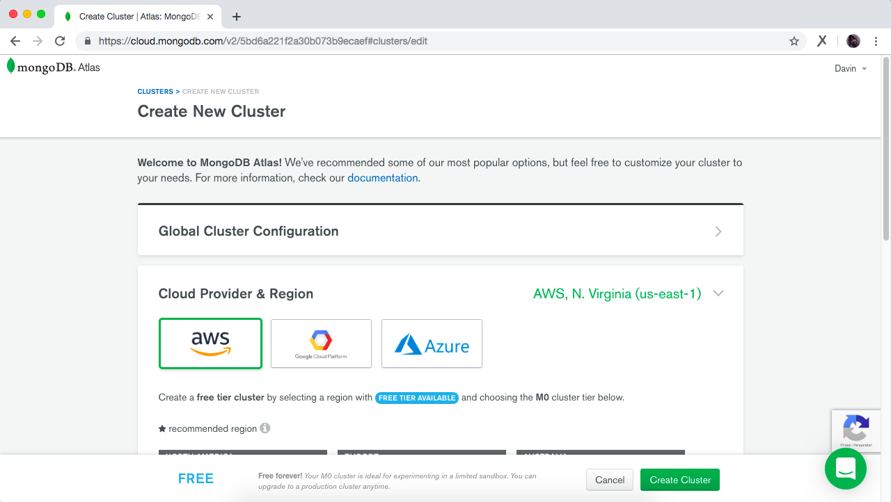
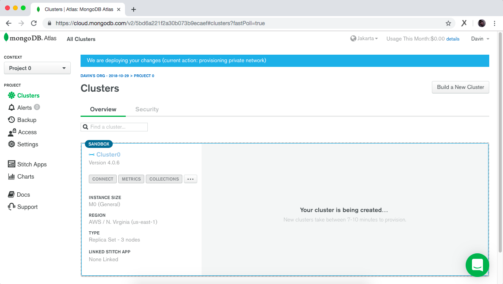
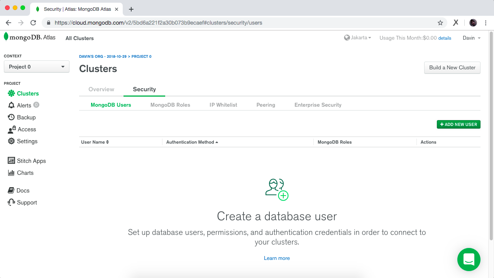
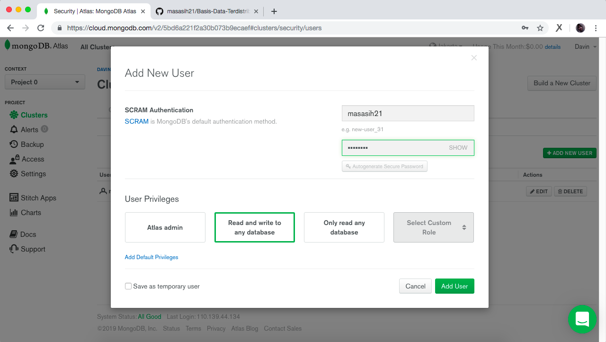
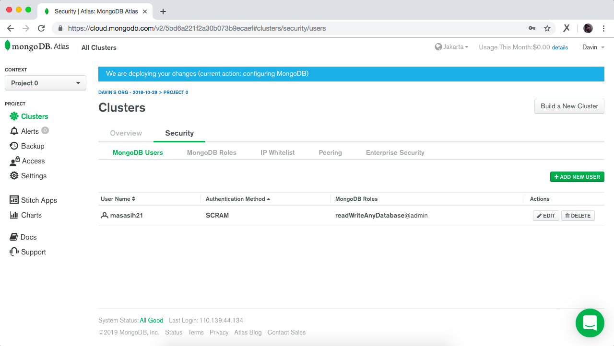

# Registrasi dan Implementasi MongoDB

## Pendahuluan
Sebelum melakukan implementasi MongoDB, download file [MongoDB Community Server](https://www.mongodb.com/download-center/community?jmp=docs) lalu install.

## 1. Registrasi
Kunjungi laman berikut : [sign up for MongoDB Atlas](https://cloud.mongodb.com/user#/atlas/register/accountProfile)

Isi form sesuai dengan petunjuk lalu klik ```continue``` dan selesaikan proses pendaftaran.

Jika berhasil maka akan tampil halaman berikut:


## 2. Implementasi Cluster MongoDB
Pada halaman tadi klik ```Build a Cluster```, akan muncul seperti berikut:

Klik pada ```Create Cluster``` di pojok bawah

Hasilnya akan terbentuk ```Cluster0```

Klik pada tab ```Security```

Pilih sub tab ```MongoDB Users```

Tambahkan user dengan mengklik ```ADD NEW USER```

Mengisi ```username``` dan ```password```

Klik ```add user```

Maka akan tampil hasil berikut:

