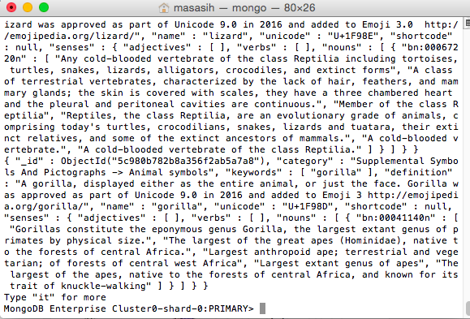

# Registrasi dan Implementasi MongoDB

## Pendahuluan
Sebelum melakukan implementasi MongoDB, download file [MongoDB Community Server](https://www.mongodb.com/download-center/community?jmp=docs) lalu install.

## 1. Registrasi MongoDB Atlas
Kunjungi laman berikut : [sign up for MongoDB Atlas](https://www.mongodb.com/cloud/atlas)

Isi form sesuai dengan petunjuk lalu klik ```Get started free``` dan selesaikan proses pendaftaran.


Jika berhasil maka akan tampil halaman berikut:


## 2. Membuat Cluster MongoDB
Pada halaman tadi klik ```Build a Cluster```, akan muncul seperti berikut:


Klik pada ```Create Cluster``` di pojok bawah

Hasilnya akan terbentuk ```Cluster0```


Klik pada tab ```Security```

Pilih sub tab ```MongoDB Users```

Tambahkan user dengan mengklik ```ADD NEW USER```


Mengisi ```username``` dan ```password```


Klik ```add user```

Maka akan tampil hasil berikut:


Pilih sub tab ```IP Whitelist```

Tambahkan IP dengan mengklik ```ADD IP ADDRESS```


Akan tampil modal


Pilih ```ADD CURRENT IP ADDRESS```

Secara otomatis akan ditambahkan IP komputer masing-masing


Klik ```confirm```

Maka akan tampil hasil berikut:


## 3. Mengimport Database
Database yang digunakan dalam tugas ini adalah database [emoji](https://www.kaggle.com/rtatman/emojinet)

Buka shell mongo, mengimport database
```
mongoimport --host cluster0-shard-00-00-ivehb.mongodb.net:27017 --db emoji --type json --file ~/Downloads/emojis.json --jsonArray --authenticationDatabase admin --ssl --username masasih21 --password 17102016
```


Kembali pada laman MongoDB, jika berhasil maka akan terjadi perubahan pada ```Metric```


## 4. Akses Data dengan Shell Mongo
Kembali pada laman MongoDB, pada cluster yang telah ada klik ```connect```


Pilih ```Connect with the Mongo Shell```

Menyalin connection string yang telah disediakan


Pada shell mongo, jalankan connection yang tadi telah dicopy
```
mongo "mongodb+srv://cluster0-ivehb.mongodb.net/test" --username masasih21
```

Isikan password

Maka akan muncul prompt:
```
MongoDB Enterprise Cluster0-shard-0:PRIMARY>
```

Untuk melihat daftar database yang telah dibuat
```
show databases
```


Pindah ke database ```emoji```
```
use emoji
```


Melihat koleksi dari database emoji
```
show collections
```


Melihat data
```
db.emojis.find()
```


## 5. Akses Data dengan MongoDB Compass
Membuka MongoDB Compass, berikut tapilan awal dari MongoDB Compass


Kembali pada laman MongoDB, pada cluster yang telah ada klik ```connect```


Pilih ```Connect with MongoDB Compass```

Menyalin connection string yang telah disediakan


Kembali pada MongoDB Compass, connection string otomatis akan terdeteksi


Klik ```Yes```

Jika benar maka akan tampil:


Isikan ```password```, lalu klik ```CONNECT```

Jika sudah berhasil, muncul data database yang telah terbentuk pada cluster tersebut


Klik pada database emoji, akan tampil collections dari database tersebut


Klik pada collections maka akan tampil data


## Referensi
https://docs.mongodb.com/manual/

https://www.youtube.com/watch?v=tpz-6Trd1UI
