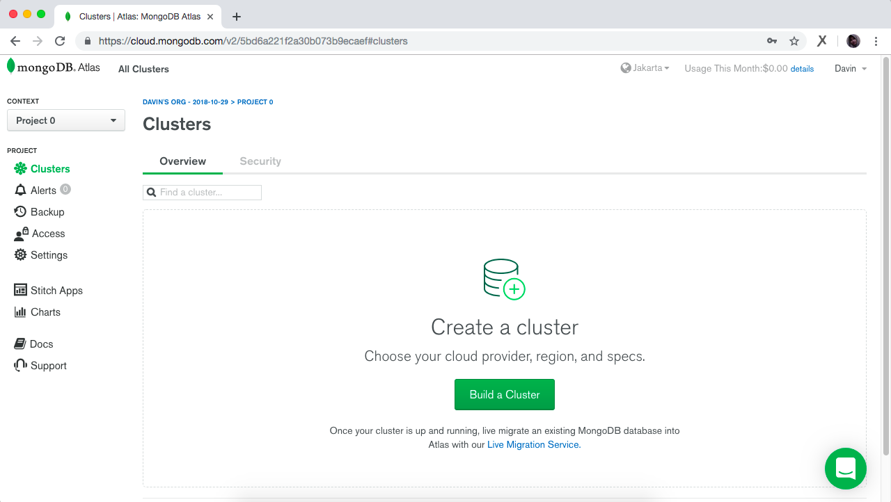
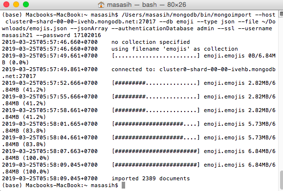

# Registrasi dan Implementasi MongoDB

## Pendahuluan
Sebelum melakukan implementasi MongoDB, download file [MongoDB Community Server](https://www.mongodb.com/download-center/community?jmp=docs) lalu install.

## 1. Registrasi MongoDB Atlas
Kunjungi laman berikut : [sign up for MongoDB Atlas](https://cloud.mongodb.com/user#/atlas/register/accountProfile)

Isi form sesuai dengan petunjuk lalu klik ```continue``` dan selesaikan proses pendaftaran.

Jika berhasil maka akan tampil halaman berikut:



## 2. Membuat Cluster MongoDB
Pada halaman tadi klik ```Build a Cluster```, akan muncul seperti berikut:


Klik pada ```Create Cluster``` di pojok bawah

Hasilnya akan terbentuk ```Cluster0```


Klik pada tab ```Security```

Pilih sub tab ```MongoDB Users```

Tambahkan user dengan mengklik ```ADD NEW USER```


Mengisi ```username``` dan ```password```


Klik ```add user```

Maka akan tampil hasil berikut:


Pilih sub tab ```IP Whitelist```

Tambahkan user dengan mengklik ```ADD IP ADDRESS```


Akan tapil modal berikut:


Pilih ```ADD CURRENT IP ADDRESS```

Secara otomatis akan ditambahkan IP komputer masing-masing


Klik ```confirm```

Maka akan tampil hasil berikut:


## 3. Mengimport Database
Database yang digunakan dalam tugas ini adalah database [emoji](https://www.kaggle.com/rtatman/emojinet)

Buka shell mongodb, mengimport database
```
mongoimport --host cluster0-shard-00-00-ivehb.mongodb.net:27017 --db emoji --type json --file ~/Downloads/emojis.json --jsonArray --authenticationDatabase admin --ssl --username masasih21 --password 17102016
```


## 4. Akses Data dengan Shell MongoDB


