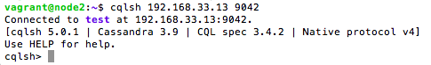
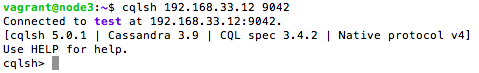

# Instalasi Cassandra Multi Node

## Pendahuluan
Sistem ini terdiri dari 2 buah Cassandra node. Berikut adalah pembagian IP beserta hostname yang digunakan:

| IP            | hostname  |
|---------------|-----------|
| 192.168.33.12	| node2     |
| 192.168.33.13	| node3     |

## 1. Instalasi Oracle Java Virtual Machine dan Cassandra
Untuk instalasi java virtual machine dan cassandra, ikuti langkah seperti pada [Instalasi Cassandra Single Node](https://github.com/masasih21/Basis-Data-Terdistribusi/tree/master/tugas%204/single-node).

### Status ```node2``` yang telah terinstall

Status java


Status cassandra


Status cluster


Tampilan antarmuka command line ```cqlsh```


### Status ```node3``` yang telah terinstall

Status java


Status cassandra


Status cluster


Tampilan antarmuka command line ```cqlsh```


## 2. Menghapus Data Default
Masuk pada cassandra node2 dan node3 (192.168.33.12, 192.168.33.13).

Sebelum menghapus data, mematikan masing-masing node cassandra terlebih dahulu
```
sudo service cassandra stop
```

Menghapus data default
```
sudo rm -rf /var/lib/cassandra/data/system/*
```

## 3. Konfigurasi Cluster
File konfigurasi Cassandra, ```cassandra.yaml``` terletak di direktori ```/etc/cassandra```. Pada langkah ini, akan dilakukan modifikasi file tersebut untuk mengatur cluster.

Membuka ```cassandra.yaml`` file untuk diedit
```
sudo nano /etc/cassandra/cassandra.yaml
```

Lakukan perubahan pada bagian-bagian berikut:
```
. . .
cluster_name: 'test'
. . .
seed_provider:
  - class_name: org.apache.cassandra.locator.SimpleSeedProvider
    parameters:
         - seeds: "192.168.33.12,192.168.33.13"
. . .
listen_address: 192.168.33.1#
. . .
rpc_address: 192.168.33.1#
. . .
endpoint_snitch: GossipingPropertyFileSnitch
. . .
```
Pada bagian bawah, tambahkan baris berikut:
```
auto_bootstrap: false
```

Keterangan:

a. cluster_name: nama cluster

b. -seeds: daftar alamat IP setiap node yang merupakan anggota cluster

c. listen_address: alamat IP yang akan digunakan node lain dalam cluster untuk terhubung ke yang node sekarang ini

d. rpc_address: alamat IP untuk panggilan prosedur jarak jauh

e. endpoint_snitch: nama snitch, yang memberi tahu Cassandra tentang seperti apa jaringannya

f. auto_bootstrap: membuat node baru secara otomatis menggunakan data yang benar

## 4. Cek Status Cluster
Menjalankan masing-masing node cassandra
```
sudo service cassandra start
```

Mengecek status cluster
```
sudo nodetool status
```

Pada node2


Pada node3


```
sudo nano /etc/iptables/rules.v4
```
```
-A INPUT -p tcp -s your_other_server_ip -m multiport --dports 7000,9042 -m state --state NEW,ESTABLISHED -j ACCEPT
```
```
sudo service iptables-persistent restart
```
```
sudo nodetool status
```
Mengecek apakah terhubung atau tidak ke cluster menggunakan ```cqlsh```
```
cqlsh your_server_ip 9042
```

Pada node2



Pada node3



## Referensi
https://www.digitalocean.com/community/tutorials/how-to-run-a-multi-node-cluster-database-with-cassandra-on-ubuntu-14-04
