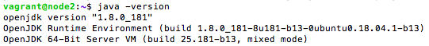
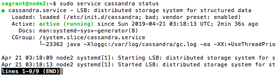
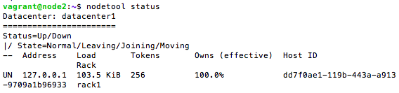
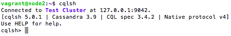
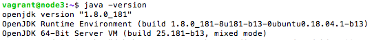
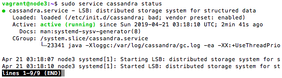
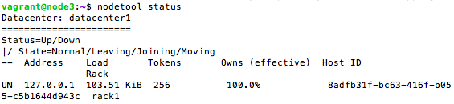
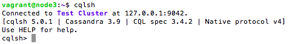

# Instalasi Cassandra Multi Node

## Pendahuluan
Sistem ini terdiri dari 2 buah Cassandra node. Berikut adalah pembagian IP beserta hostname yang digunakan:

| IP            | hostname  |
|---------------|-----------|
| 192.168.33.12	| node2     |
| 192.168.33.13	| node3     |

## 1. Instalasi Oracle Java Virtual Machine dan Cassandra
Untuk instalasi java virtual machine dan cassandra, ikuti langkah seperti pada [Instalasi Cassandra Single Node](https://github.com/masasih21/Basis-Data-Terdistribusi/tree/master/tugas%204/single-node).

### Status ```node2``` yang telah terinstall

Status java



Status cassandra



Status cluster



Tampilan antarmuka command line ```cqlsh```



### Status ```node3``` yang telah terinstall

Status java



Status cassandra



Status cluster



Tampilan antarmuka command line ```cqlsh```




## A
```
sudo service cassandra stop
```
```
sudo rm -rf /var/lib/cassandra/data/system/*
```
```
sudo nano /etc/cassandra/cassandra.yaml
```
```
. . .
cluster_name: 'CassandraDOCluster'
. . .
seed_provider:
  - class_name: org.apache.cassandra.locator.SimpleSeedProvider
    parameters:
         - seeds: "your_server_ip,your_server_ip_2,...your_server_ip_n"
. . .
listen_address: your_server_ip
. . .
rpc_address: your_server_ip
. . .
endpoint_snitch: GossipingPropertyFileSnitch
. . .
```
```
auto_bootstrap: false
```
```
sudo service cassandra start
```
```
sudo nodetool status
```
```
sudo nano /etc/iptables/rules.v4
```
```
-A INPUT -p tcp -s your_other_server_ip -m multiport --dports 7000,9042 -m state --state NEW,ESTABLISHED -j ACCEPT
```
```
sudo service iptables-persistent restart
```
```
sudo nodetool status
```
```
cqlsh your_server_ip 9042
```
