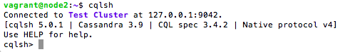

# Instalasi Cassandra Multi Node

## Pendahuluan
Sistem ini terdiri dari 2 buah Cassandra node. Berikut adalah pembagian IP beserta hostname yang digunakan:

| IP            | hostname  |
|---------------|-----------|
| 192.168.33.12	| node1     |
| 192.168.33.13	| node2     |

## 1. Instalasi Oracle Java Virtual Machine dan Cassandra
Untuk instalasi java virtual machine dan cassandra, ikuti langkah seperti pada [Instalasi Cassandra Single Node](https://github.com/masasih21/Basis-Data-Terdistribusi/tree/master/tugas%204/single-node).

```node2``` yang telah terinstall

Status java


Status cassandra


Status cluster


Tampilan antarmuka command line ```cqlsh```

