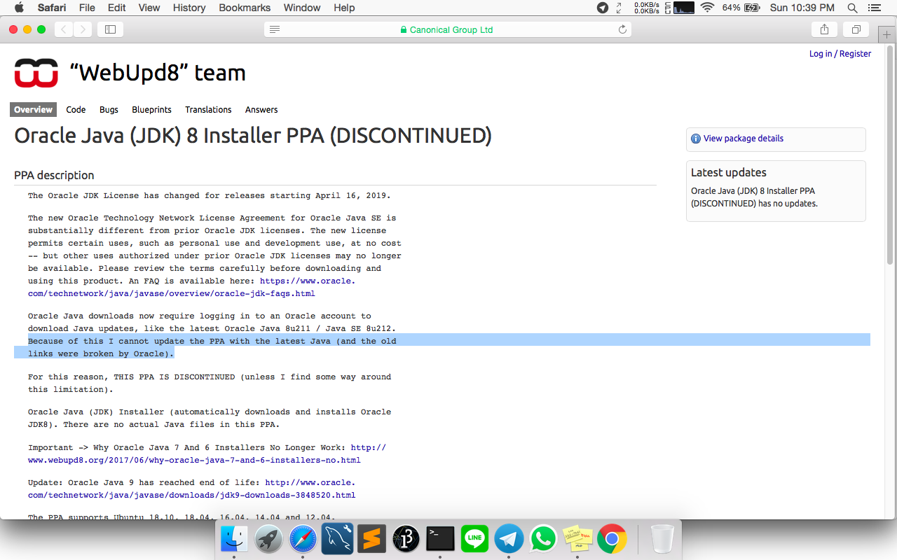
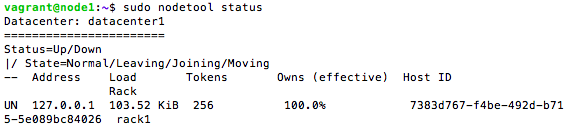

# Instalasi Cassandra Single Node

## Pendahuluan
Sistem ini terdiri dari sebuah Cassandra node. IP yang digunakan adalah ```192.168.33.11``` dengan hostname ```node1```.

## 1. Instalasi Oracle Java Virtual Machine
Menginstall ```properties-common``` untuk dapat menambahkan ```add-repository```
```
$ sudo apt-get update
$ sudo apt-get install software-properties-common
```

Untuk membuat paket Oracle JRE tersedia, menambahkan repositori Personal Package Archives (PPA) menggunakan perintah berikut:
```
$ sudo add-apt-repository ppa:webupd8team/java
```
Mengupdate package yang telah ditambahkan
```
$ sudo apt-get update
```
Menginstall java
```
$ sudo apt-get install oracle-java8-set-default
```
Mengecek java yang telah terinstall
```
$ java -version
```


## 2. Instalasi Open JDK
*) dikarenakan per 16 April 2019 ada perubahan lisensi dari Apache, ppa tidak dapat digunakan lagi, maka instalasi Oracle Java Virtual Machine akan gagal



sehingga dapat diganti dengan instalasi menggunakan Open JDK

Menginstall Open JDK

```
$ sudo apt install openjdk-8-jdk
$ sudo apt install openjdk-8-jre
```

Mengecek list alternatif java yang tersedia

```
$ update-java-alternatives -l
```

Mengecek java yang telah terinstall
```
$ java -version
```


## 3. Instalasi Cassandra
Menambahkan repositori cassandra ke ```/etc/apt/sources.list.d/cassandra.sources.list``` dengan perintah berikut:
```
$ echo "deb http://www.apache.org/dist/cassandra/debian 39x main" | sudo tee -a /etc/apt/sources.list.d/cassandra.sources.list
```
*) 39x berarti menggunakan Cassandra versi 3.9

Menjalankan ```cURL``` untuk menambahkan kunci dari repositori
```
$ curl https://www.apache.org/dist/cassandra/KEYS | sudo apt-key add -
```
Mengupdate repositori
```
$ sudo apt-get update
```
Menginstall cassandra
```
$ sudo apt-get install cassandra
```
Mengecek status cassandra
```
$ sudo service cassandra status
```


## 4. Menghubungkan ke Cluster
Setelah berhasil menginstall cassandra, periksa status cluster dengan perintah berikut:
```
$ sudo nodetool status
```


*) UN berarti ```Up``` dan ```Normal```, semua berjalan dengan normal

Menghubungkan dengan antarmuka command line ```cqlsh```
```
$ cqlsh
```


## Referensi
https://www.digitalocean.com/community/tutorials/how-to-install-cassandra-and-run-a-single-node-cluster-on-ubuntu-14-04
https://www.liquidweb.com/kb/install-cassandra-ubuntu-16-04-lts/
