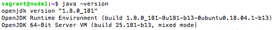
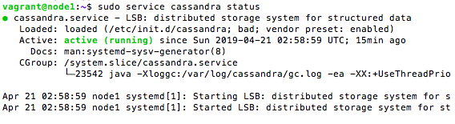
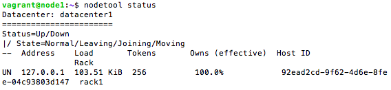
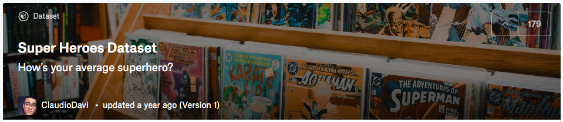
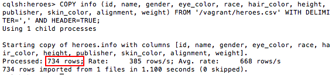
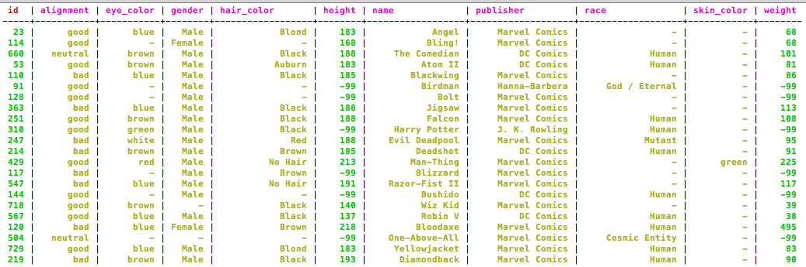
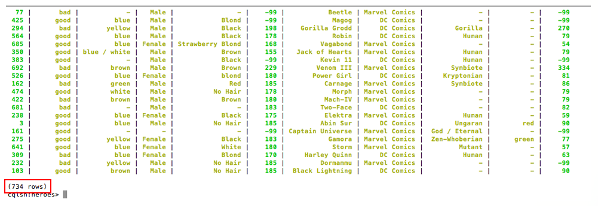
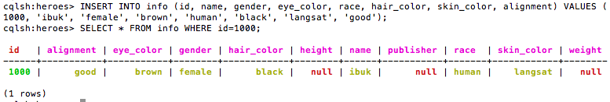
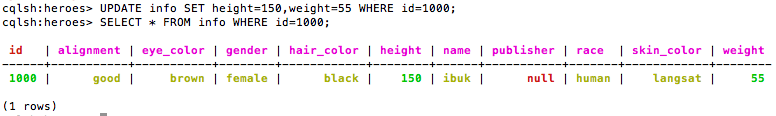
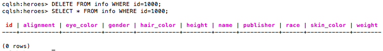

# Implementasi Cassandra Single Node

## Pendahuluan
apa itu database Cassandra dan apa perbedaannya dengan database relational dan database NoSQL lainnya.

Apache Cassandra adalah database terdistribusi yang sangat scalable (dapat diukur) dan berkinerja tinggi yang dirancang untuk mengelola data terstruktur dengan skala yang sangat besar di banyak server komoditas tanpa kegagalan. Apache Cassandra  merupakan salah satu implementasi dari NoSQL (Not only SQL) disamping CouchDB, MongoDB dan OrientDB. Cassandra secara otomatis mereplikasi data ke simpul (node) yang mendukung replikasi di beberapa pusat data yang terkait. Dengan arsitektur desentralisasi seperti ini risiko kegagalan penyimpanan data dapat meminimalkan secara default.

Fitur utama Cassandra:
* Desentralisasi: setiap node di cluster memiliki peran yang sama. Data didistribusikan lintas cluster (sehingga setiap node berisi data yang berbeda), namun tidak ada master karena setiap node dapat melayani permintaan apapun yang sama.
* Mendukung replikasi di multi data center: Strategi replikasi dapat dikonfigurasi. Cassandra dirancang sebagai sistem terdistribusi, untuk penyebaran sejumlah node di beberapa pusat data.
* Skalabilitas: Penambahan kapasitas penyimpanan dapat ditambah sewaktu waktu dan tanpa terikat hardware dan lokasi yang sama.
* Fault-tolerant: Data secara otomatis direplikasi ke beberapa node untuk mentoleransi kesalahan.
* Bahasa query: Memperkanalkan CQL (Cassandra Query Language), SQL-like alternatif terhadap antarmuka RPC tradisional.

Relational Database	                                              | NoSql Database
---------------------------------------------------------------------------------------------------------
Supports powerful query language.                                 | Supports very simple query language.
It has a fixed schema.                                            | No fixed schema.
Follows ACID (Atomicity, Consistency, Isolation, and Durability). | It is only “eventually consistent”.
Supports transactions.                                            | Does not support transactions.

## 1. Arsitektur Server

## 2. Instalasi Cassandra Single Node
Untuk instalasi cassandra single node, ikuti langkah seperti pada tugas sebelumnya yakni [Instalasi Cassandra Single Node](https://github.com/masasih21/Basis-Data-Terdistribusi/tree/master/tugas%204/single-node).

Status Java



Status Cassandra



Status Cluster



## 3. Dataset
Dataset yang saya gunakan di sini adalah [Super Heroes Dataset](https://www.kaggle.com/claudiodavi/superhero-set#heroes_information.csv) yang berisi karakteristik pahlawan super.



Dataset ini memiliki 11 fitur yakni:
* ID
* Name : nama atau alias dari superhero
* Gender : jenis kelamin
* Eye Color : warna mata
* Race : ras
* Hair Color : warna rambut
* Height : tinggi badan (diukur dalam centimeter)
* Publisher : penerbit
* Skin Color : warna kulit
* Alignment : apakah termasuk superhero baik atau buruk
* Weight : berat badan (diukur dalam pound)

## 4. Import Dataset
Masuk pada command line cassandra
```
$ cqlsh
```

Membuat ```keyspace``` atau database pada cassandra dengan nama ```heroes```
```
cqlsh> CREATE KEYSPACE heroes WITH REPLICATION = {'class':'NetworkTopologyStrategy','datacenter1':1};
```
> Database yang dibuat bernama heroes dengan replication factors 1

Menggunakan keyspace ```heroes```
```
cqlsh> use heroes;
```

Membuat tabel ```info``` dengan 10 fitur dan tipe data seperti berikut:
```
cqlsh:heroes> CREATE TABLE info (id int PRIMARY KEY, name text, gender text, eye_color text, race text, hair_color text, height float, publisher text, skin_color text, alignment text, weight float);
```

Mengimport dataset ```heroes.csv```
```
cqlsh:heroes> COPY info (id, name, gender, eye_color, race, hair_color, height, publisher, skin_color, alignment, weight) FROM '/vagrant/heroes.csv' WITH DELIMITER=',' AND HEADER=TRUE;
```


> Tertulis Processed : 734 rows; yang berarti berhasil mengimport sebanyak 734 data.

Mengecek hasil import data
```
cqlsh:heroes> SELECT * FROM info;
```




## 5. CRUD Data
### a. Create Data
Menambahkan data baru pada tabel ```info```
```
cqlsh:heroes> INSERT INTO info (id, name, gender, eye_color, race, hair_color, skin_color, alignment) VALUES (1000, 'ibuk', 'female', 'brown', 'human', 'black', 'langsat', 'good');
```



> INSERT INTO *nama_tabel* (*list_kolom*) VALUES (*isi_kolom*);

> Menambahkan data dengan *id=100*, *name=ibuk*, *gender=female*, *eye_color=brown*, *race=human*, *hair_color=black*, *skin_color=langsat*, dan *aligment=good* pada tabel *info*, list kolom yang tidak disebutkan dalam insert maka akan terisi default *null*

### b. Read Data
Membaca data pada tabel ```info```
```
cqlsh:heroes> SELECT * FROM info;
```


> SELECT *list_kolom* FROM *nama_tabel*;

> Membaca *semua kolom* dari tabel *info*

### c. Update Data
Mengubah data pada tabel ```info```
```
cqlsh:heroes> UPDATE info SET height=150,weight=55 WHERE id=1000;
```


> UPDATE nama_tabel SET list_kolom=isi_kolom WHERE kondisi;

> Mengubah data *height=150* dan *weight=55* yang *idnya 1000* pada tabel *info*

### d. Delete Data
Menghapus data pada tabel ```info```
```
cqlsh:heroes> DELETE FROM info WHERE id=1000;
```


> DELETE FROM nama_tabel WHERE kondisi;

> Menghapus data pada tabel *info* yang *idnya 1000*

## Kesimpulan
Proses CRUD pada cassandra hampir sama dengan query pada mysql biasanya. Bedanya hanya pada pembuatan database yang pada cassandra disebut dengan ```keyspace``` yang mana pada pembuatannya diikuti dengan inisialisasi *class strategy*, *datacenter_name*, dan jumlah *replication_factor*. 

## Referensi
http://gudanglinux.com/glossary/nosql-cassandra/
https://medium.com/@danairwanda/pengenalan-cassandra-database-nosql-3d33a768a20
https://www.digitalocean.com/community/tutorials/how-to-install-cassandra-and-run-a-single-node-cluster-on-ubuntu-14-04
https://docs.datastax.com/en/cql/3.3/cql/cql_reference/cqlCommandsTOC.html
https://www.datastax.com/dev/blog/simple-data-importing-and-exporting-with-cassandra
