# Implementasi Redis

## Pendahuluan
**Redis** adalah salah satu database NoQSL yang berbasis key-value store. Sistemnya yang in-memory membuat pengambilan data dari Redis menjadi lebih cepat, namun juga persistent bila ingin menyimpan data ke disk. Redis memiliki sejumlah query yang pastinya mudah digunakan untuk menyimpan mulai dari data sederhana hingga data kompleks.


**Keunggulan** Redis :
1. Sangat cepat - Redis bisa melakukan sekitar 110000 SET per detik, sekitar 81000 GET per detik.
2. Mendukung banyak tipe data - Redis secara native mendukung sebagian besar tipe data yang telah diketahui pengembang seperti list, set, sorted, dan hash yang diurutkan.
3. Operasi bersifat atom - Semua operasi Redis bersifat atom, yang memastikan bahwa jika dua klien mengakses secara bersamaan, server Redis akan menerima nilai yang diperbarui.
4. Multi-utility tool - Redis memiliki multi-utility tool dan dapat digunakan dalam sejumlah kasus penggunaan seperti caching, messaging-queues (Redis native mendukung Publish / Subscribe), data singkat dalam aplikasi, seperti web sessions aplikasi, web page hit counts, dll.

Perbedaan dengan database Key-Value store lainnya :
1. Redis adalah jalur evolusi yang berbeda dalam DB-nilai kunci, di mana nilai dapat berisi tipe data yang lebih kompleks, dengan operasi atom yang didefinisikan pada tipe data tersebut.
2. Redis adalah database in-memori tapi tetap pada basis data disk, oleh karena itu merupakan trade off yang berbeda dimana kecepatan tulis dan baca yang sangat tinggi dicapai dengan keterbatasan kumpulan data yang tidak boleh lebih besar dari pada memori.
3. Keuntungan lain dari database memori adalah bahwa representasi memori dari struktur data kompleks jauh lebih sederhana untuk dimanipulasi dibandingkan dengan struktur data yang sama pada disk. Dengan demikian, Redis bisa melakukan banyak hal dengan sedikit kompleksitas internal.

## 1. Arsitektur Server
Sistem ini terdiri dari 1 buah master dan 2 buah slave. Berikut adalah pembagian IP beserta hostname yang digunakan:

| IP            | Nama                | hostname  |
|---------------|---------------------|-----------|
| 192.168.33.11	|	master              | node1     |
| 192.168.33.12	|	slave	              | node2     |
| 192.168.33.13	|	slave			          | node3     |

## 2. Instalasi Redis
Menginstall ```build-essential``` yang memuat dependensi untuk redis, paket ```tcl```, dan ```jemalloc``` pada setiap node
```
$ sudo apt-get update 
$ sudo apt-get install build-essential tcl
$ sudo apt-get install libjemalloc-dev  (Optional)
```

Mengunduh package ```redis```
```
$ curl -O http://download.redis.io/redis-stable.tar.gz
```

Mengekstrak package ```redis```
```
$ tar xzvf redis-stable.tar.gz
```

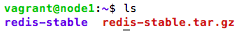

Pindah ke direktori ```redis-stable```
```
$ cd redis-stable
```

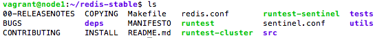

Mengkompilasi binari redis
```
$ make
```

Menjalankan test untuk memastikan semuanya dibangun dengan benar
```
$ make test
```

Menginstall binari ke sistem
```
$ sudo make install
```

Port default untuk server ```redis``` adalah ```6379``` dan ```sentinel``` adalah ```26379```. Oleh karena itu berikan akses koneksi berikut:

untuk redis dan sentinel
```
$ sudo ufw allow 6379
$ sudo ufw allow 26379
```

untuk ip lain
```
$ sudo ufw allow from 192.168.33.11
$ sudo ufw allow from 192.168.33.12
$ sudo ufw allow from 192.168.33.13
```

Melakukan konfigurasi pada file ```redis.conf```

Pada ```Master``` (192.168.33.11)
```
protected-mode no
port 6379
logfile "/home/vagrant/redis-stable/redis.log"
dir .
```

Pada ```slave``` (192.168.33.12, 192.168.33.13)
```
protected-mode no
port 6379
logfile "/home/vagrant/redis-stable/redis.log"
dir .
slaveof 192.168.33.11 6379 #memberitahu Redis cluster untuk membuat instance server khusus ini sebagai instance SLAVE dari node MASTER yang diberikan (192.168.33.11).
```

Melakukan konfigurasi pada file ```sentinel.conf``` pada setiap node
```
protected-mode no
port 26379
logfile "/home/vagrant/redis-stable/sentinel.log"
sentinel monitor mymaster 192.168.33.11 6379 2 #memberitahu sentinel untuk memonitor master node, 2 sebagai jumlah kuorum
sentinel down-after-milliseconds mymaster 5000 #server tidak akan merespons selama 5 detik sebelum diklasifikasikan +down dan mengaktifkan +vote untuk memilih node master baru
sentinel failover-timeout mymaster 10000 #menentukan batas waktu failover dalam milidetik
```

Menjalankan redis
```
$ src/redis-server redis.conf &
$ src/redis-server sentinel.conf --sentinel &
```

Memeriksa proses redis, setiap node harus menjalankan proses redis dan proses sentinel
```
$ ps -ef | grep redis
```

pada node1

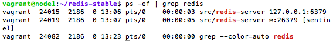

pada node2

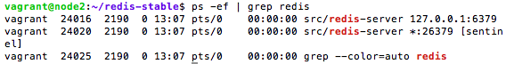

pada node3

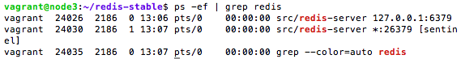


Melakukan ```ping``` untuk menguji apakah redis berfungsi dengan baik
```
$ redis-cli ping
or
$ redis-cli -h 192.168.33.1# ping
```

hasil

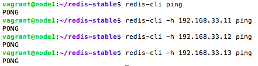

Mengecek ```redis.log``` pada masing-masing node

pada node master

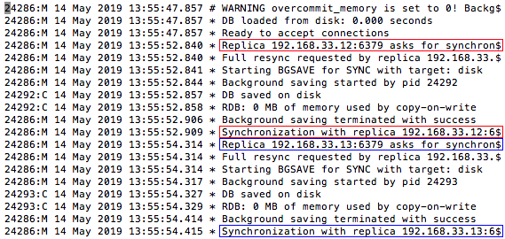

pada node slave

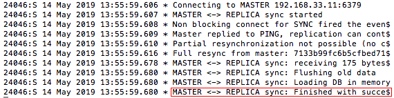

Mengecek ```sentinel.log``` pada masing-masing node

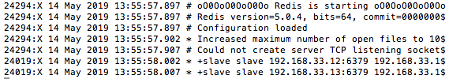

Mengecek status replikasi masing-masing node

pada node1 dengan ```role:master```

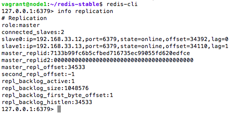

pada node2 dengan ```role:slave```

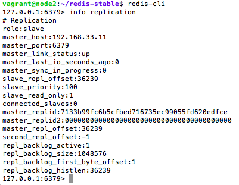

pada node3 dengan ```role:slave```

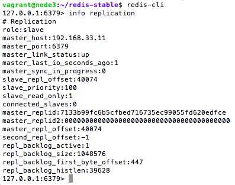

## 3. CRUD Data

### a. Create Data
Menambahkan data baru atau ```key``` dengan ```value```
> set *key* *value*

### b. Read Data
Membaca data dari ```key``` yang telah ditambahkan
> get *key*

### c. Update Data
Mengupdate data ```key```
> set *key* *value*
jika *key* yang disebutkan sudah ada sebelumnya, maka *set* ini akan berfungsi mengupdate *key* yang ditunjuk

### d. Delete Data
Menghapus data ```key```
> del *key*

hasil:

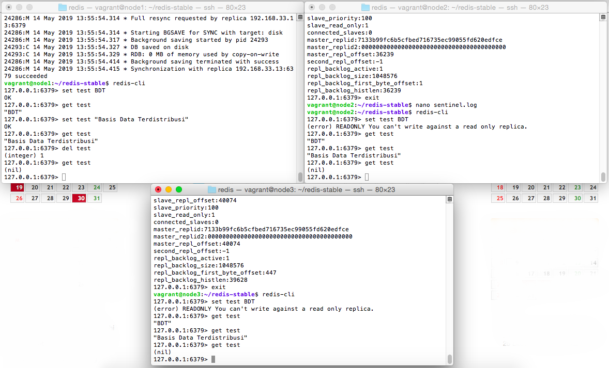

slave hanya dapat membaca data, sedangkan proses menulis hanya dapat dilakukan pada master

## 4. Simulasi Fail Over
Mematikan salah satu node, dalam simulasi ini dilakukan dengan mematikan node ```master``` (192.168.33.11)
```
$ kill -9 <process id>
or
$ redis-cli -p 6379 DEBUG sleep 30
or
$ redis-cli -p 6379 DEBUG SEGFAULT
```

Ketika node ```master``` mati, maka secara otomatis salah satu node ```slave``` akan dipromosikan menjadi ```master```

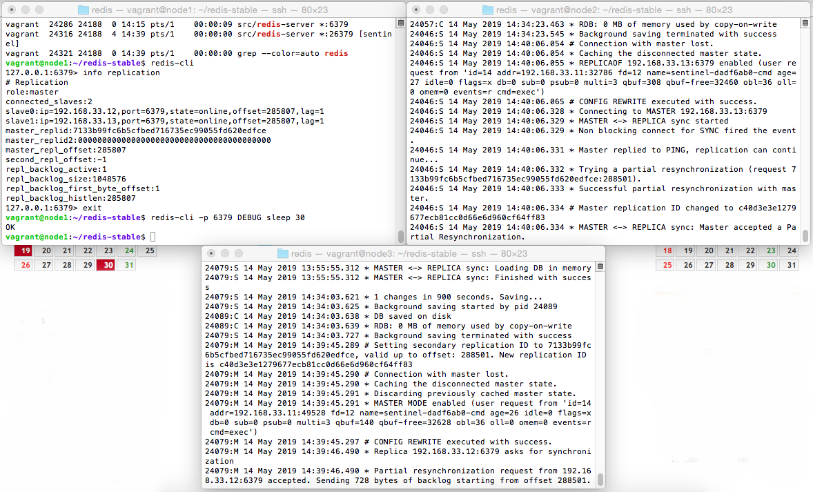

Mengecek status replikasi yang telah berubah

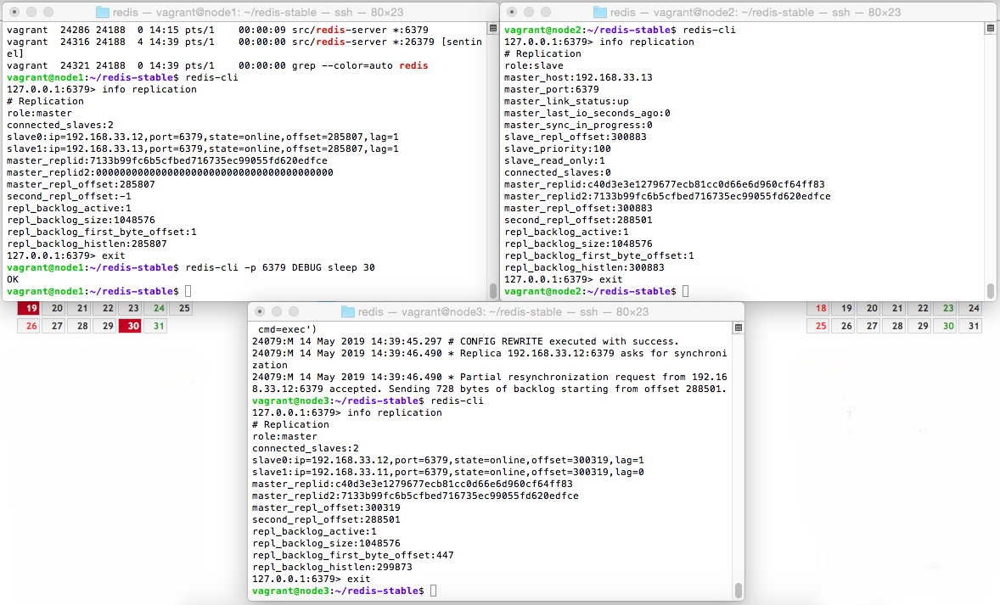

## Kesimpulan

## Referensi
https://www.kapalomen.com/2017/09/pengenalan-database-redis-keuntungan.html
https://www.codepolitan.com/pdkt-dengan-redis
https://medium.com/@amila922/redis-sentinel-high-availability-everything-you-need-to-know-from-dev-to-prod-complete-guide-deb198e70ea6
https://redis.io/commands
