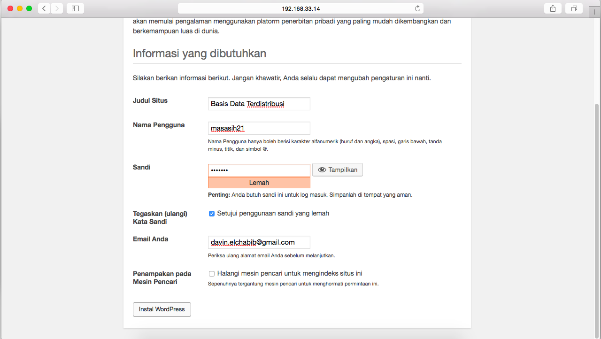
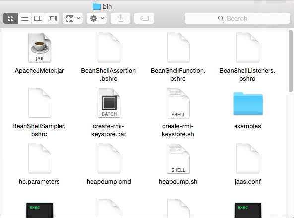
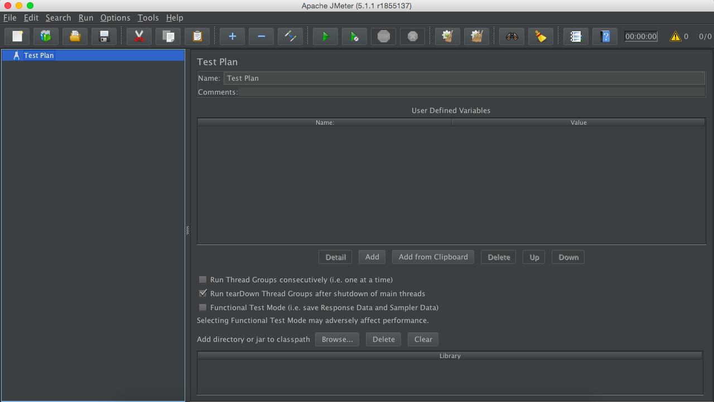
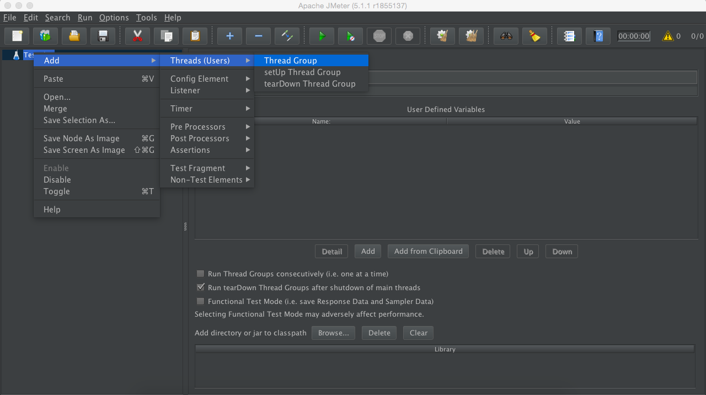
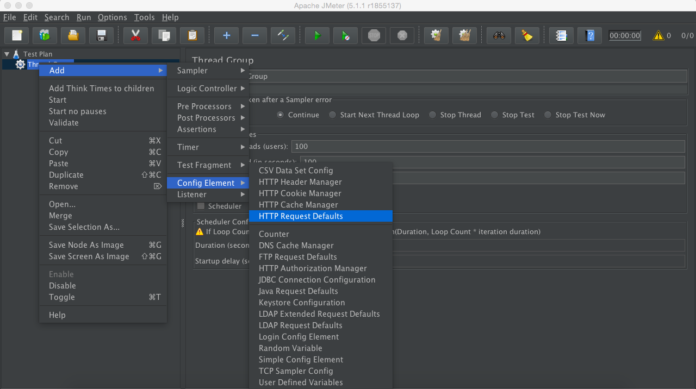
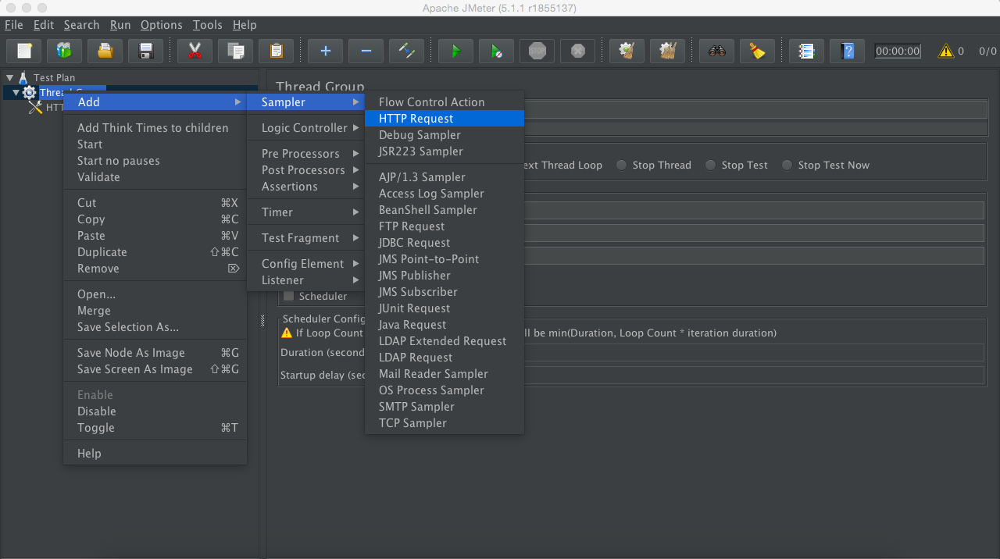
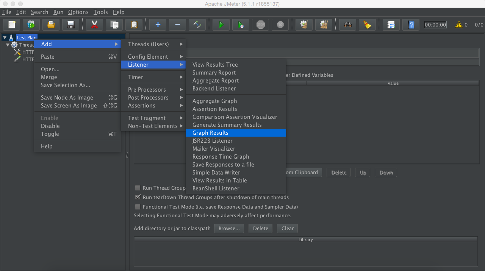

# Tugas Evaluasi Tengah Semester

## A.	Model Arsitektur
Sistem ini terdiri dari sebuah NDB Manager, 3 buah Data Node, 2 buah MySQL API Node, dan sebuah ProxySQL sebagai Load Balancer.
Berikut adalah pembagian IP beserta hostname yang digunakan:

| IP            | Nama                      | hostname  |
|---------------|---------------------------|-----------|
| 192.168.33.10	|	NDB Manager             	| manager   |
| 192.168.33.11	|	Data Node dan API Node		| data1     |
| 192.168.33.12	|	Data Node dan API Node		| data2     |
| 192.168.33.13	|	Data Node				          | data3     |
| 192.168.33.14	|	ProxySQL				          | proxy     |

## B.	Implementasi
### 1.	Konfigurasi Awal
Pada salah satu node data, dibuat database baru ```wordpress```
```
mysql> CREATE DATABASE wordpress;
```


Memberikan akses grup replikasi untuk database ```wordpress```
```
mysql> GRANT ALL PRIVILEGES on wordpress.* to 'bdtuser'@'%';
```
Menyimpan perubahan
```
mysql> FLUSH PRIVILEGES;
mysql> EXIT;
```

### 2.	Instalasi Apache dkk
Menginstall apache dan php pada ```proxySQL```
```
$ sudo apt-get update
$ sudo apt-get install apache2
$ sudo apt-get install php -y
$ sudo apt-get install php-mysql
$ sudo apt-get install -y php-gd php-imap php-ldap php-odbc php-pear php-xml php-xmlrpc php-mbstring php-snmp php-soap php-tidy curl
```
### 3.	Instalasi Wordpress
Mengunduh package ```wordpress```
```
$ cd /tmp
$ wget -c http://wordpress.org/latest.tar.gz
```
Mengekstrak package ```wordpress```
```
$ tar -xzvf latest.tar.gz
```
Menghapus file ```index.html``` pada ```/var/www/html```
```
$ sudo rm /var/www/html/*
```
Memindah isi package ```wordpress``` untuk diletakkan pada folder html
```
$ sudo mv wordpress/* /var/www/html
```


Memberikan akses pada folder ```/var/www/html```
```
$ sudo chown -R www-data:www-data /var/www/html
$ sudo chmod -R 755 /var/www/html
```
Menyimpan perubahan
```
$ sudo service apache2 restart
```

-------
Menyalin ```schema.php``` ke luar agar mudah untuk diedit
```
$ cp /var/www/html/wp-admin/includes/schema.php /vagrant
```
Menambahkan ```ENGINE=ndbcluster``` pada schema wordpress yang telah ada. Simpan perubahan.

Menyalin kembali ```schema.php``` yang telah diperbaharui
```
$ sudo cp /vagrant/schema.php /var/www/html/wp-admin/includes/
```

Pindah ke direktori html
```
$ cd /var/www/html
```
Menyalin isi ```wp-config-sample.php``` ke dalam ```wp-config.php```
```
$ sudo cp wp-config-sample.php wp-config.php
```
Mengedit isi file ```wp-config.php```
```
$ sudo nano wp-config.php
```
Menambahkan keterangan berikut:
```
...
/** The name of the database for WordPress */
define('DB_NAME', 'wordpress');

/** MySQL database username */
define('DB_USER', 'bdtuser');

/** MySQL database password */
define('DB_PASSWORD', 'bdt');

/** MySQL database password */
define('DB_HOST', '192.168.33.14:6033');
...
```

-------
Membuka ```192.168.33.14``` pada browser maka akan terlihat hasil seperti berikut:

Melakukan setting bahasa yang akan digunakan


Memberi nama situs dan membuat user baru




Wordpress berhasil terinstall dengan baik


Proses Login


Halaman dashboard admin


Jika berhasil maka database pada service node otomatis akan terupdate
```
mysql> use wordpress
mysql> show tables;
```


## C. Simulasi Fail Over
Mencoba mematikan salah satu service node
```
$ sudo systemctl stop mysql
```


Meskipun salah satu service node dimatikan, laman wordpress masih bisa diakses dengan baik.

Begitupun ketika service node 1 dihidupkan kembali, dan service node 2 dimatikan.

## D. JMeter
jMeter atau Apache JMeter adalah aplikasi open source berbasis Java yang dapat dipergunakan untuk performance test. Bagi seorang QA Engineer jMeter bisa digunakan untuk melakukan load/stress testing Web Application, FTP Application dan Database server test.

### 1. Instalasi JMeter
Paket-paket jMeter bisa langsung didownload di situs [jmeter.apache.org](https://jmeter.apache.org/download_jmeter.cgi). Pilih Binaries, download sesuai yang dibutuhkan. Jika proses download sudah selesai, lalu ekstrak.

### 2. Menjalankan JMeter
Pada folder ekstraksi jMeter, masuk ke folder bin.



Klik dua kali pada ```ApacheJMeter.jar```



### 3. Membuat Performance Test Plan
Menyiapkan Test Plan
#### Menambahkan trafik/user visitor ke dalam komponen yang mau dites.
```
Klik kanan Test Plan
Add > Threads(Users) > Thread Group
```


Dalam kontrol panel Thread Group, entri pada Thread Properties:

– Number of threads (users) : isi berapa user/visitor yang akan mengakses web.

– Ramp-Up period ( in seconds ) : isi berapa waktu delay antara user satu dengan yang lainnya dalam mengakses web.

– Loop Count : waktu eksekusi, bertahap atau seterusnya.


#### Menambahkan web server/IP Address yang akan dites.
```
Klik kanan Threads Group
Add > Config Element > HTTP Request Defaults
```


Pada ```Web Server``` mengisikan Server Name atau IP dan Portnya, atau gampangnya isi website/url yang akan ditest. URL diisi dengan format http://www.


Jika tidak hanya halaman utama yang di test, kita bisa menambahkan path/foldernya, caranya :
```
Klik kanan Threads Group
Add > Sampler > HTTP Request
```


Isi web server, port dan path


#### Menampilkan proses dan hasil test secara grafis atau bentuk tabel.
```
Klik kanan Test Plan
Add > Listener > Graph Result
```


```
Klik kanan Test Plan
Add > Listener > View Results in Table
```


#### Menjalankan Test secara otomatis.

Simpan terlebih dahulu Test Plan yang telah dibuat di File > Save ( Ctrl + S ).

Klik Run atau Ctrl + R, jMeter akan mulai mensimulasi sejumlah user dalam mengakses web server yang telah ditentukan.


## Referensi
https://www.digitalocean.com/community/tutorials/how-to-install-wordpress-with-lamp-on-ubuntu-16-04
http://blog.hendri.web.id/performance-test-sederhana-dengan-jmeter/
https://www.guru99.com/jmeter-performance-testing.html
