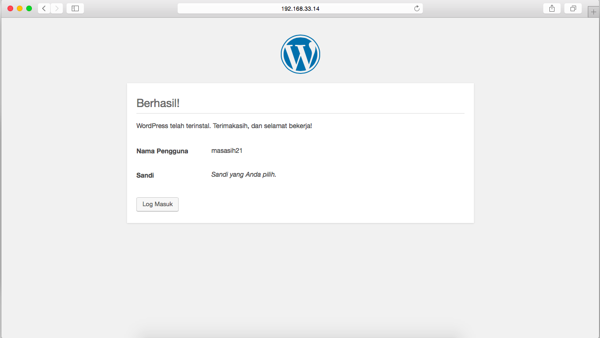

# Tugas Evaluasi Tengah Semester

## A.	Model Arsitektur
Sistem ini terdiri dari sebuah NDB Manager, 3 buah Data Node, 2 buah MySQL API Node, dan sebuah ProxySQL sebagai Load Balancer.
Berikut adalah pembagian IP beserta hostname yang digunakan:

| IP            | Nama                      | hostname  |
|---------------|---------------------------|-----------|
| 192.168.33.10	|	NDB Manager             	| manager   |
| 192.168.33.11	|	Data Node dan API Node		| data1     |
| 192.168.33.12	|	Data Node dan API Node		| data2     |
| 192.168.33.13	|	Data Node				          | data3     |
| 192.168.33.14	|	ProxySQL				          | proxy     |

## B.	Implementasi
### 1.	Konfigurasi Awal
Pada salah satu node data, dibuat database baru ```wordpress```
```
mysql> CREATE DATABASE wordpress;
```


Memberikan akses grup replikasi untuk database ```wordpress```
```
mysql> GRANT ALL PRIVILEGES on wordpress.* to 'bdtuser'@'%';
```
Menyimpan perubahan
```
mysql> FLUSH PRIVILEGES;
mysql> EXIT;
```

### 2.	Instalasi Apache dkk
Menginstall apache dan beberapa ekstensi php pada ```proxySQL```
```
sudo apt-get install apache2
sudo apt-get install php -y
sudo apt-get install php-mysql
sudo apt-get install -y php-gd php-imap php-ldap php-odbc php-pear php-xml php-xmlrpc php-mbstring php-snmp php-soap php-tidy curl
```
### 3.	Instalasi Wordpress
Mengunduh package ```wordpress```
```
cd /tmp
wget -c http://wordpress.org/latest.tar.gz
```
Mengektrak package yang ```wordpress```
```
tar -xzvf latest.tar.gz
```
Menghapus file ```index.html``` pada ```/var/www/html```
```
sudo rm /var/www/html/*
```
Memindah isi package ```wordpress``` untuk diletakkan pada folder html
```
sudo mv wordpress/* /var/www/html
```


Memberikan akses pada folder ```/var/www/html```
```
sudo chown -R www-data:www-data /var/www/html
sudo chmod -R 755 /var/www/html
```
Menyimpan perubahan
```
sudo service apache2 restart
```


Menyalin ```schema.php``` ke luar agar mudah untuk diedit
```
cp /var/www/html/wp-admin/includes/schema.php /vagrant
```
Menambahkan ```ENGINE=ndbcluster``` pada schema wordpress yang telah ada. Simpan perubahan.

Menyalin kembali ```schema.php yang telah diperbaharui
```
cp /vagrant/schema.php /var/www/html/wp-admin/includes/
```


Menyalin isi ```wp-config-sample.php``` ke dalam ```wp-config.php```
```
cp wp-config-sample.php wp-config.php
```
Mengedit isi file ```wp-config.php```
```
...
define('DB_NAME', 'wordpress');

/** MySQL database username */
define('DB_USER', 'bdtuser');

/** MySQL database password */
define('DB_PASSWORD', 'bdt');

/** MySQL database password */
define('DB_HOST', '192.168.33.14:6033');
...
```


Membuka ```192.168.33.14``` pada browser maka akan terlihat hasil seperti berikut:





Jika berhasil maka database pada service node otomatis akan terupdate
```
mysql> use wordpress
mysql> show tables;
```


## JMeter
